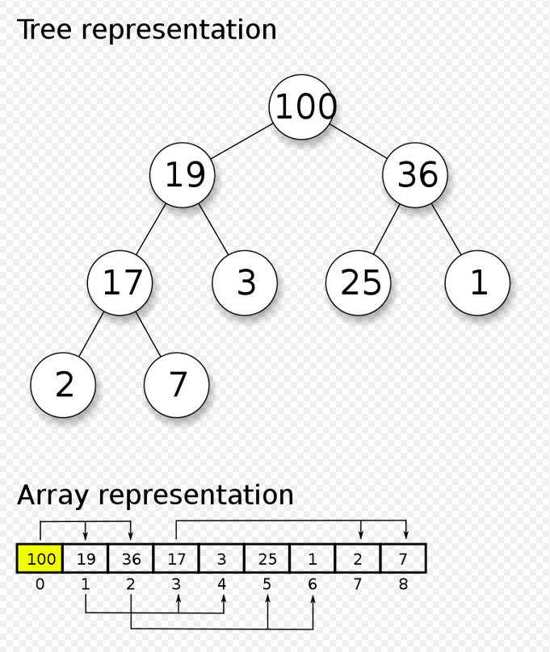

# Heap Data Structure

- [https://en.wikipedia.org/wiki/Max_heap](https://en.wikipedia.org/wiki/Max_heap)
- [https://en.wikipedia.org/wiki/Heap_(data_structure)](https://en.wikipedia.org/wiki/Heap_(data_structure))

## Max Heap

## Time Complexity

- O(log n) - O of the height of the tree (insertion and extraction);
